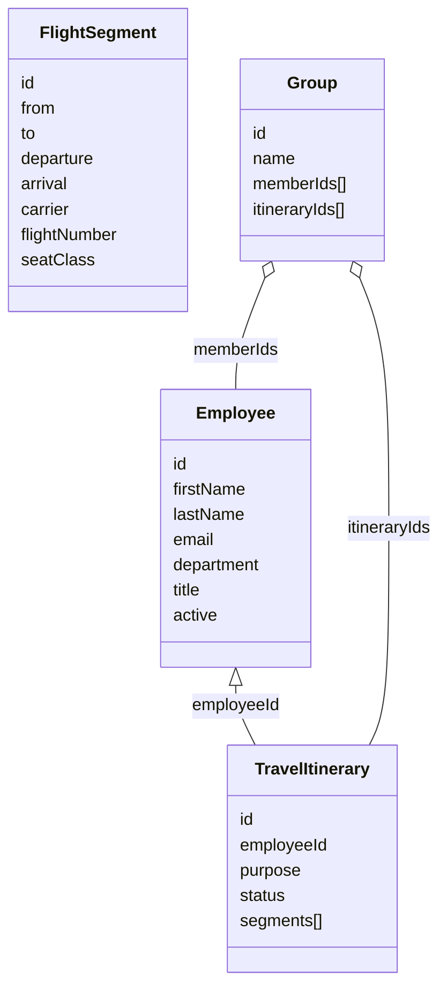

## Flight Planner (Case for Frontend-kandidat)

Dette er et reiseplanleggingssystem for et mellomstort selskap. Domenet inkluderer tre kjerne-ressurser:

1. Employees – ansatte som kan reise.
2. Travel Itineraries – reiseplaner bestående av en eller flere flight-segmenter.
3. Groups – grupper av ansatte og tilknyttede itineraries (for felles reisenheter / prosjektreiser).

### Arkitektur

- **Frontend**: React + Vite + Tailwind (port 5173)
- **Backend**: Java Spring Boot (port 3001)
- **Database**: PostgreSQL (via Docker) eller H2 for testing

Frontend proxyer alle `/api/*` kall til Java backend automatisk via Vite dev server.

### Teknologi

**Backend (Java)**:
- Spring Boot 3.2
- Spring Data JPA
- PostgreSQL
- SpringDoc OpenAPI (Swagger UI)

**Frontend**:
- React 19
- Vite
- Tailwind CSS
- TypeScript

### Kom i gang / Kjøring

#### 1. Start Database (optional - for full PostgreSQL)

```bash
cd Backend
docker-compose up -d
```

#### 2. Start Java Backend

```bash
cd Backend
./mvnw spring-boot:run
```

Backend kjører på: `http://localhost:3001`
Swagger docs: `http://localhost:3001/swagger-ui.html`

#### 3. Start Frontend

```bash
cd frontend
npm install
npm run dev
```

Frontend kjører på: `http://localhost:5173`

### Miljøvariabler

**Backend** (`Backend/src/main/resources/application.yml`):
- `SERVER_PORT`: Backend port (default: 3001)
- `API_KEY`: API nøkkel for autentisering (default: dev-key)
- `CORS_ORIGINS`: Tillatte origins (default: http://localhost:5173)

**Frontend** (`frontend/.env`):
- `VITE_API_BASE`: API base URL (default: /api)
- `VITE_API_KEY`: API nøkkel (default: dev-key)

### Autentisering & Sikkerhet

Alle API-endepunkter under `/api/*` krever headeren:

```
x-api-key: <din-nøkkel>
```

Default nøkkel er `dev-key` (konfigurert i `application.yml`).

Unntak: `/health` og `/swagger-ui.html` er åpne.

### Rate Limiting

En enkel IP-basert limiter er aktiv:
| Header | Forklaring |
|--------|-----------|
| `X-RateLimit-Limit` | Maks antall forespørsler per vindu |
| `X-RateLimit-Remaining` | Gjenværende i nåværende vindu |
| `X-RateLimit-Reset` | ISO-tidspunkt når vinduet nullstilles |

Ved overskridelse: HTTP 429 med kropp:

```json
{ "error": { "code": "RATE_LIMIT", "message": "Too many requests", "retryAfterMs": 12345 } }
```

### Feilformat

Alle feil følger strukturen:

```json
{
  "error": {
    "code": "VALIDATION",
    "message": "Validation failed",
    "details": [{ "path": ["firstName"], "message": "Required" }]
  }
}
```

Eksempler på `code`:
| Code | Situasjon |
|------|-----------|
| `UNAUTHORIZED` | Manglende / feil API key |
| `VALIDATION` | Valideringsfeil |
| `NOT_FOUND` | Ressurs finnes ikke |
| `REF_INTEGRITY` | Brudd på referanse (f.eks. ukjent employeeId) |
| `RATE_LIMIT` | For mange forespørsler |

### Teste lokalt (eksempel med curl)

```bash
curl -H "x-api-key: dev-key" http://localhost:3001/api/employees
```

Opprett employee:

```bash
curl -X POST -H "Content-Type: application/json" -H "x-api-key: dev-key" \
  -d '{"firstName":"Anna","lastName":"Aasen","email":"anna@example.com","department":"Engineering","title":"Developer"}' \
  http://localhost:3001/api/employees
```

### Domenemodell



### Ressurser & Endepunkter

Alla endepunkter beskrives i Swagger (`/swagger-ui.html`). Kort oversikt:

| Resource    | Endepunkter                                                                                                                                                               |
| ----------- | ------------------------------------------------------------------------------------------------------------------------------------------------------------------------- |
| Health      | `GET /health`                                                                                                                                                             |
| Employees   | `GET /api/employees`, `GET /api/employees/:id`, `POST /api/employees`, `PATCH /api/employees/:id`, `DELETE /api/employees/:id`                                            |
| Itineraries | `GET /api/itineraries` (filter: `employeeId`, `status`), `GET /api/itineraries/:id`, `POST /api/itineraries`, `PATCH /api/itineraries/:id`, `DELETE /api/itineraries/:id` |
| Groups      | `GET /api/groups`, `GET /api/groups/:id`, `POST /api/groups`, `PATCH /api/groups/:id`, `DELETE /api/groups/:id`                                                           |

### Datavalidering (utdrag)

Employee (create):

```json
{
  "firstName": "Anna",
  "lastName": "Aasen",
  "email": "anna@example.com",
  "department": "Engineering",
  "title": "Developer"
}
```

Itinerary (create):

```json
{
  "employeeId": "emp1",
  "purpose": "Kundemøte i Stockholm",
  "segments": [
    {
      "from": "OSL",
      "to": "ARN",
      "departure": "2025-10-01T07:30:00Z",
      "arrival": "2025-10-01T08:25:00Z",
      "carrier": "SK",
      "flightNumber": "SK894",
      "seatClass": "economy"
    }
  ]
}
```

### Oppgave til frontend-kandidat

Lag en liten webklient som gir et oversiktlig grensesnitt for dette domenet.

Oppgaven vil bli presentert under intervjuet

Vurderingskriterier:

- Kodearkitektur og modularitet
- UX (oversiktlighet, konsistens, tilbakemeldinger)
- Dataflyt og asynkron håndtering
- Edge cases (ingen data, loading, feil)

### Forslag til videre forbedringer (ikke implementert)

- Autentisering (JWT / OIDC)
- RBAC (rollebasert tilgang)
- Revisjonslogg av endringer
- Rate limiting og caching-headere
- Database + migreringer
- Notifikasjoner / webhooks ved endringer

### Swagger

Se `http://localhost:3001/swagger-ui.html` for auto-generert API dokumentasjon.

Lykke til! ✈️
